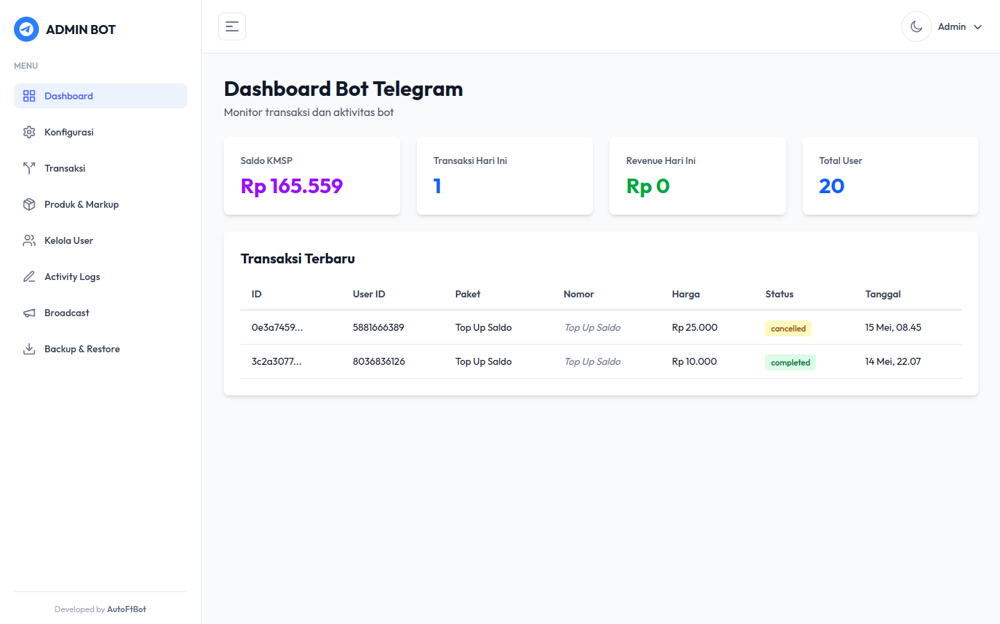
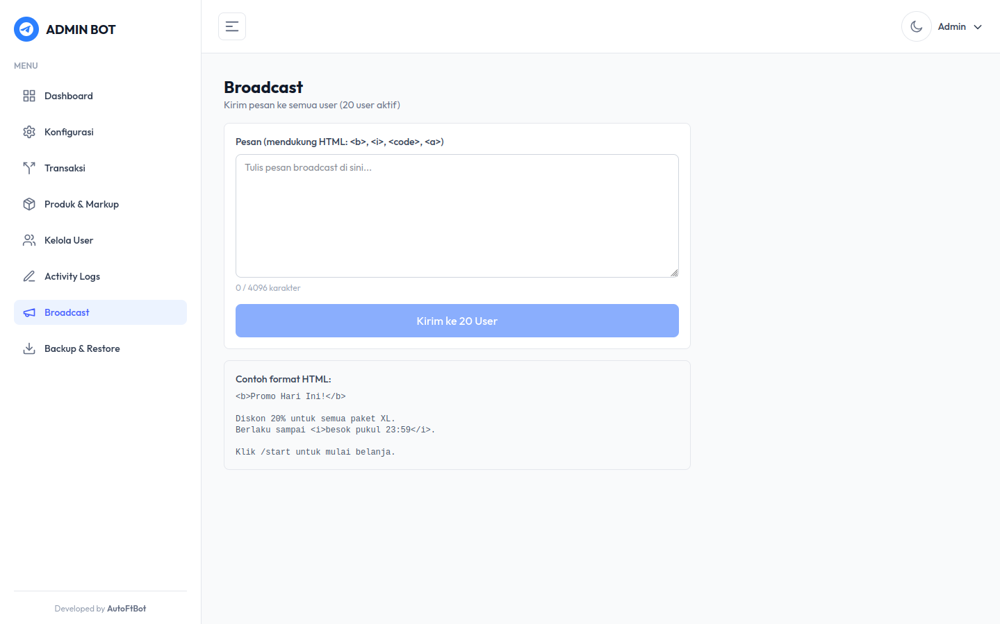

<p align="center">
  
  
  
  
</p>

<h1 align="center">🛒 Telegram Bot Store</h1>

<p align="center">
  <strong>Bot jualan paket data otomatis via Telegram — lengkap dengan Admin Dashboard real-time.</strong>
</p>

<p align="center">
  Full-stack solution: Telegram Bot + REST API Backend + Modern Admin Panel.<br/>
  Semua perubahan di admin dashboard langsung ter-reflect secara <b>real-time</b> ke bot tanpa restart.
</p>

---

## 📸 Screenshots Admin Dashboard

| Dashboard | Transaksi |
|:---------:|:---------:|
|  |  |

| Produk & Markup | Kelola User |
|:--------------:|:-----------:|
|  |  |

| Broadcast | Backup & Restore |
|:---------:|:----------------:|
|  |  |

> 💡 Dashboard mendukung **Dark Mode** dan fully responsive (mobile-friendly).

---

## ⚡ Real-Time Sync

Semua perubahan yang dilakukan di Admin Dashboard langsung berlaku di bot **tanpa perlu restart**:

| Aksi di Admin | Efek di Bot |
|---------------|-------------|
| Ubah harga/markup produk | User langsung lihat harga baru |
| Ban/Unban user | User langsung terblokir/terbuka aksesnya |
| Edit saldo user | Saldo user langsung berubah |
| Ubah konfigurasi bot | Bot langsung pakai config baru |
| Tambah/hapus produk | Katalog bot langsung update |
| Broadcast pesan | Semua user langsung terima pesan |

> Tidak ada delay, tidak perlu restart bot. Perubahan terjadi **instan**.

---

## 🚀 Fitur Lengkap

### 🤖 Telegram Bot
- Pembelian paket data otomatis (multi-operator)
- Pembayaran via **QRIS** (auto-detect) & **Saldo**
- Sistem top-up saldo
- Cek kuota & cek area coverage
- Riwayat transaksi lengkap
- Role system: **Member** & **Reseller** (markup berbeda)
- Anti-group (hanya private chat)

### 🖥️ Admin Dashboard
- **Dashboard** — statistik transaksi, revenue, saldo provider
- **Konfigurasi** — setting bot langsung dari web
- **Transaksi** — monitoring & filter real-time
- **Produk & Markup** — kelola harga, sync dari provider
- **Kelola User** — ban/unban, edit saldo, ubah role
- **Activity Logs** — semua aktivitas tercatat
- **Broadcast** — kirim pesan ke semua user
- **Backup & Restore** — backup database otomatis & manual

### ⚙️ Backend API
- Go (Gin) — performa tinggi, low memory
- SQLite — ringan, tanpa setup database terpisah
- JWT Authentication
- Rate limiting & security middleware
- Auto backup database setiap 12 jam
- Auto cleanup session & log expired

---

## 🏗️ Tech Stack

| Layer | Teknologi |
|-------|-----------|
| Bot | Node.js + grammY |
| Backend | Go + Gin + SQLite |
| Admin | Next.js 16 + Tailwind CSS + Recharts |
| Deploy | PM2 + Nginx + Let's Encrypt |

---

## 📦 Struktur Project

```
├── bot/                  # Telegram Bot (Node.js)
├── backend/              # REST API (Go)
├── admin-dashboard/      # Admin Panel (Next.js)
└── deploy.sh             # One-click deploy script
```

---

## 🛠️ Quick Deploy

Deploy ke VPS dengan satu command:

```bash
chmod +x deploy.sh
./deploy.sh
```

Script akan otomatis:
1. Build semua service (backend, bot, admin)
2. Upload ke VPS
3. Setup PM2, Nginx, SSL certificate
4. Jalankan semua service

---

## 📋 Requirements

- VPS (Ubuntu 20.04+) dengan minimal 1GB RAM
- Domain yang sudah pointing ke IP VPS
- API key dari provider (KMSP/HidePulsa)
- Bot token dari [@BotFather](https://t.me/BotFather)

---

## 💰 Harga & Info

Tertarik dengan source code ini?

**DM** 👉 [@AutoFtbot69](https://t.me/AutoFtbot69)

---

<p align="center">
  <sub>Developed by <strong>AutoFtBot</strong></sub>
</p>
