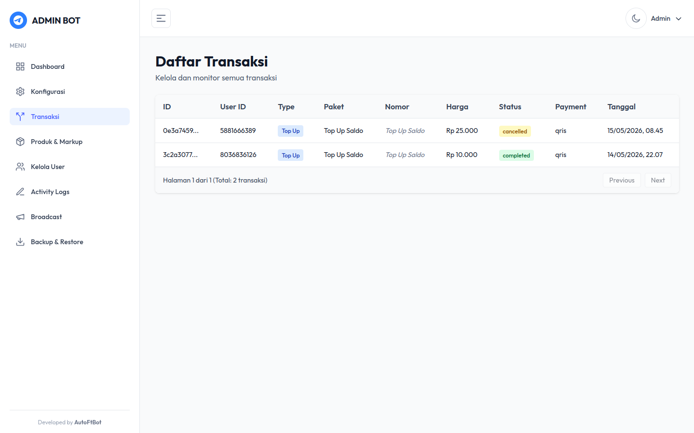
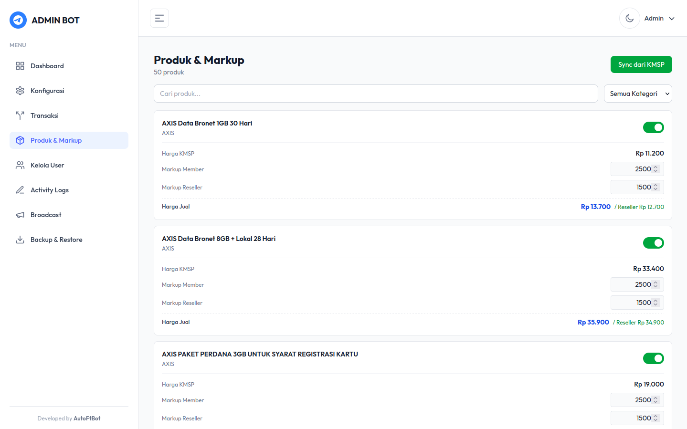
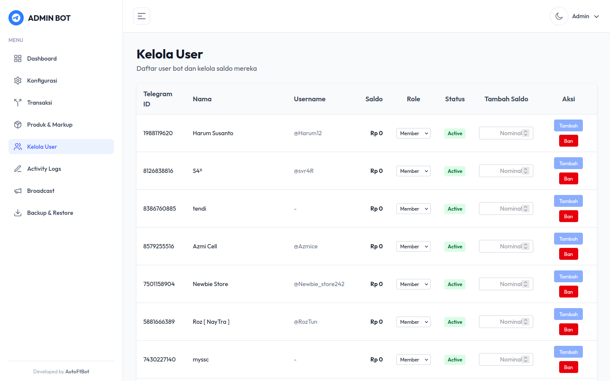
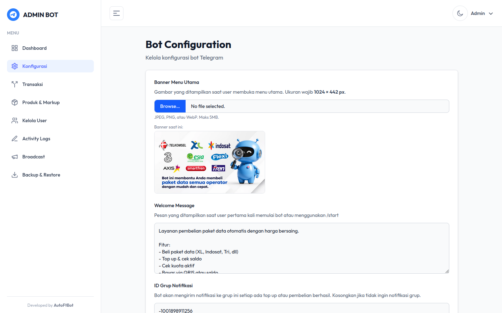
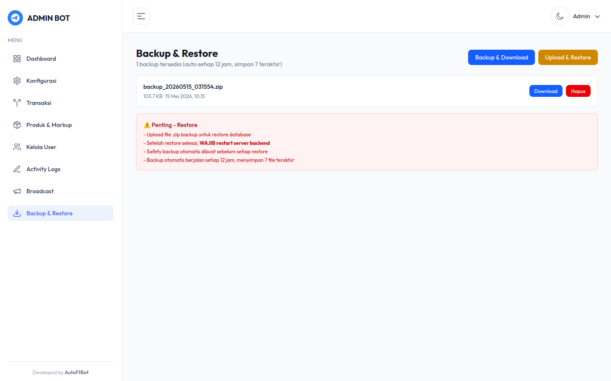
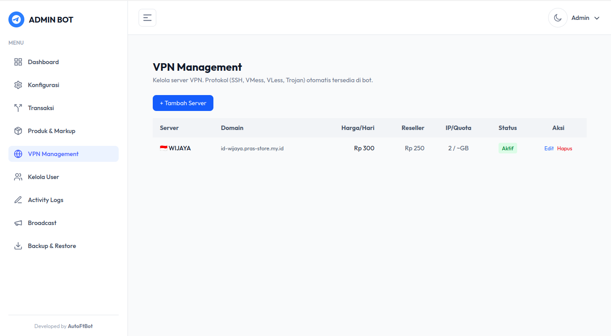
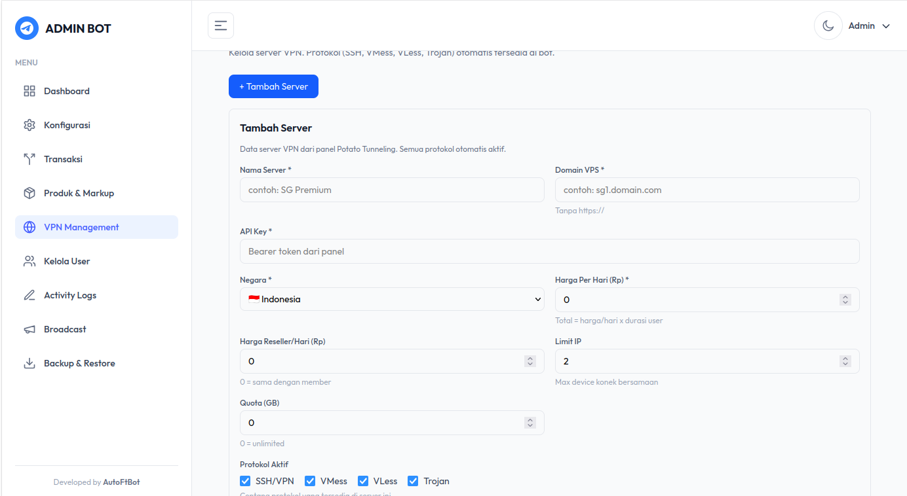

  
  
  
  

<h1 align="center">Telegram Bot Store</h1>

  <strong>Bot jualan paket data & VPN otomatis via Telegram — lengkap dengan Admin Dashboard real-time.</strong>

  Full-stack solution: Telegram Bot + REST API Backend + Admin Panel. 
  Semua perubahan di admin dashboard langsung ter-reflect secara <b>real-time</b> ke bot tanpa restart.

---

## Screenshots Admin Dashboard

| Dashboard | Transaksi |
|:---------:|:---------:|
|  |  |

| Produk & Markup | Kelola User |
|:--------------:|:-----------:|
|  |  |

| Konfigurasi | Broadcast |
|:-----------:|:---------:|
|  |  |

| Backup & Restore |
|:----------------:|
|  |

| VPN Manage | Add VPN Server |
|:----------:|:--------------:|
|  |  |

---

## Fitur Lengkap

### Telegram Bot
- Pembelian paket data otomatis (multi-operator)
- VPN Tunneling (SSH/VPN, VMess, VLess, Trojan)
- Trial VPN 10 menit (limit per server untuk member, unlimited untuk reseller)
- Pembayaran via QRIS (auto-detect) & Saldo
- Sistem top-up saldo
- Cek kuota & cek area coverage
- Riwayat transaksi lengkap
- Role system: Member & Reseller (markup berbeda)
- Anti-group (hanya private chat)
- Notifikasi grup (pembelian, top up, VPN create/renew/delete)

### VPN Tunneling
- Multi-server dengan pagination
- Protokol: SSH/VPN, VMess, VLess, Trojan
- Custom durasi (numpad input)
- Custom username & password (SSH)
- Renew akun (perpanjang durasi)
- Delete akun dengan refund pro-rata
- Cek config akun aktif
- Trial 10 menit per server

### Admin Dashboard
- Dashboard — statistik transaksi, revenue, saldo provider
- Konfigurasi — welcome message, banner, URL buttons
- Transaksi — monitoring & filter real-time
- Produk & Markup — kelola harga member & reseller, sync dari provider
- Kelola User — ban/unban, edit saldo, ubah role
- VPN Server — kelola server, protokol, harga
- Activity Logs — semua aktivitas tercatat
- Broadcast — kirim pesan ke semua user
- Backup & Restore — backup database otomatis & manual
---

## Real-Time Sync

Semua perubahan di Admin Dashboard langsung berlaku di bot tanpa restart:

| Aksi di Admin | Efek di Bot |
|---------------|-------------|
| Ubah harga/markup produk | User langsung lihat harga baru |
| Ban/Unban user | User langsung terblokir/terbuka |
| Edit saldo user | Saldo langsung berubah |
| Ubah konfigurasi bot | Bot langsung pakai config baru |
| Tambah/hapus produk | Katalog bot langsung update |
| Broadcast pesan | Semua user langsung terima |
| Tambah/edit VPN server | Bot langsung tampilkan server baru |
---

SOURCE CODE PM : https://t.me/AutoFtBot69
